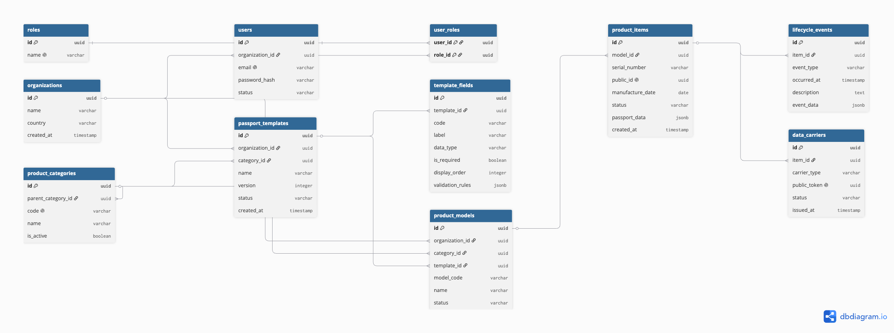

# Database Design

## Entity-Relationship Diagram

## Main Entities

- Organization
- User
- Role
- ProductCategory
- PassportTemplate
- TemplateField
- ProductModel
- ProductItem
- LifecycleEvent
- DataCarrier

## Notes

The database uses a hybrid model:

- relational tables for stable entities and relationships;
- JSONB for configurable passport data;
- external storage for documents and images.
