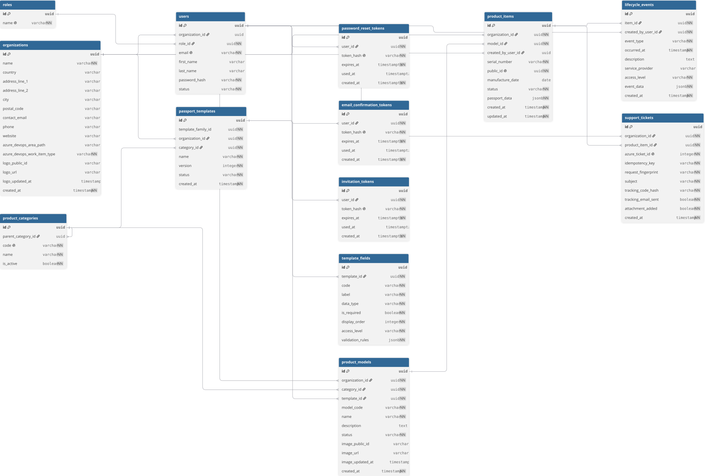

# Database Design

## Entity-relationship diagram

The editable and more detailed schema source is
[mvp-schema.dbml](diagrams/mvp-schema.dbml). Both files describe the current
SQLAlchemy models and applied Alembic migrations.

## Implemented entities

- Organization
- User
- Role
- ProductCategory
- PassportTemplate
- TemplateField
- ProductModel
- ProductItem
- LifecycleEvent
- SupportTicket

There is no persisted `DataCarrier` entity. QR codes are generated on demand
from `ProductItem.public_id`, and NFC stores the same public passport URL.

## Storage approach

The database uses a hybrid model:

- relational tables and foreign keys for stable identities, ownership, and
  lifecycle relationships;
- PostgreSQL JSONB for configurable template validation rules, passport values,
  and optional lifecycle-event data;
- Cloudinary for organization logos and product-model images;
- Azure DevOps for the full support work item, its attachment, current state,
  and conversation.

Only Cloudinary identifiers/URLs and the minimum local Azure ticket tracking
metadata are stored in PostgreSQL.

## Identity, roles, and organization isolation

Each user has exactly one role through `users.role_id`. Organization
administrators and service technicians belong to an organization, while a
platform-level administrator may have no organization. Authorization loads the
current user, role, and organization from the database for each protected
request.

Organization-owned entities store `organization_id` directly where it makes
ownership checks and uniqueness constraints explicit. Model codes and product
serial numbers are unique within an organization, rather than globally.

## Versioned passport structure

Each `passport_templates` row is one exact version. Its primary key identifies
that version, while `template_family_id` groups the complete history. The
combination of family and version is unique.

Template fields belong to one exact version and are copied when a new Draft is
created. Active and Archived versions keep the definitions that were valid when
they were used. Each product model references one exact active template version,
so later template versions cannot silently change existing product structures.

`template_fields.validation_rules` stores type-specific JSONB rules. The
application and database constraints restrict field types and access levels.

## Product items and lifecycle history

Each product item references a product model, organization, and optional creator
for legacy compatibility. New items always record the user who registered them.
The random unique `public_id` is the only item identifier placed in a public
passport URL.

Configurable values are stored in `product_items.passport_data` as JSONB and are
validated against the fields of the model's exact template version. Items move
from Draft to Published and then optionally to Retired. Lifecycle events form an
append-only history for published or retired items, record their creator, and
carry either `public` or `manufacturer` access.

## Support-ticket metadata

`support_tickets` connects one local product item to one Azure DevOps work item.
It stores:

- organization and product ownership;
- the unique Azure ticket number;
- an idempotency key and request fingerprint used to prevent duplicates;
- the subject shown on the public tracking page;
- a SHA-256 hash of the private tracking code, never the plaintext code;
- flags recording whether email delivery and the optional attachment completed.

Ticket status and comments are not duplicated locally. After the tracking code
is verified, they are fetched from Azure DevOps. This keeps Azure DevOps as the
source of truth for the service process while PostgreSQL provides DPP ownership,
idempotency, and private-code verification.
